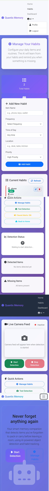

# 🧠 Quantix Memory AI


> ✨ A smart AI assistant that helps you avoid forgetting things! Quantix Memory simulates object tracking and memory reminders to enhance your everyday productivity.

---

## 🌐 Live Demo
🔗 [Click here to open Quantix Memory](https://quantix-memory-ai.onrender.com)

---


## 🖼 Website Preview



---

## 🧠 Key Features

- 🚀 Detects forgotten items using memory assistant logic
- 🔁 Simulates real-time feedback system
- 📱 Clean, responsive UI
- ☁ Hosted using Render for instant access

---

## 🛠 Built With

- HTML, CSS, JavaScript
- Render (Deployment)
- GitHub (Version Control)

---

## 🧪 How to Use Locally

```bash
git clone https://github.com/Poorvika1-droid/Quantix-Memory.git
cd Quantix-Memory
# Open index.html directly in your browser